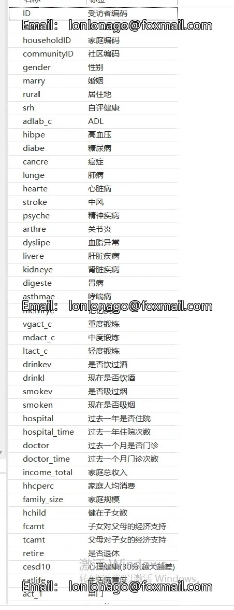
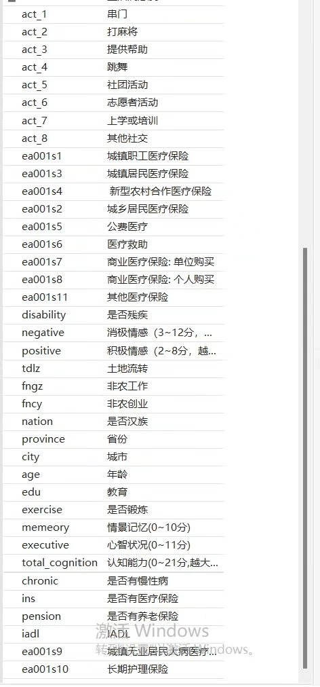
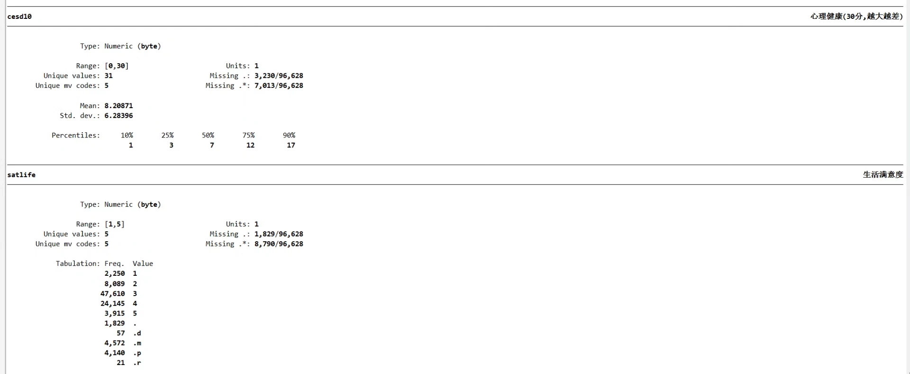
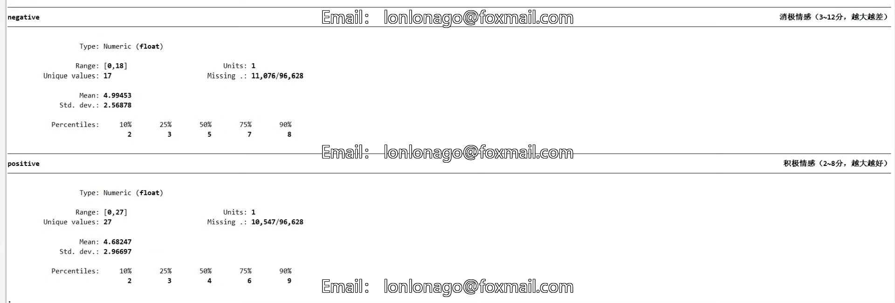

## Body

CHARLS study on subjective well-being data cleaning

Data variables as shown in the figure, self-check for reference. If you have special needs, please contact us for customization. Private message for detailed discussion.
To prevent counterfeiting, the code for data cleaning is not sent out yet. If you need the code, please private message for free access.

Subjective well-being refers to people's self-evaluation of their own quality of life, which includes two aspects of comprehensive subjective feelings: cognitive judgments about life satisfaction and emotional aspects composed of independent positive and negative emotions.

Core variables:
Life satisfaction
Mental health (CES-D10)
Positive emotions
Negative emotions
The positive and negative emotion indicators are designed based on the method of scale design by Liu Qi and Chen Lu:
1. Positive emotion indicator (positive): Selecting the frequency of experiences from "I am full of hope for the future" and "I am very happy" in the questionnaire to construct an evaluation index for urban residents' positive emotions. The scores are assigned 0-3 for "rare or none (<1 day), not much (1-2 days), half time (3-4 days), most of the time (5-7 days)", and then summed up. The score range is 0-6, with higher values indicating higher positive emotions.
2. Negative emotion indicator (negative): Building its negative emotion evaluation index based on the experience frequencies of "I am troubled by some small things," "I feel down," and "I can't continue living." Similarly, the scores of these three questions are summed up, with a score range of 0-9, and higher values indicating higher negative emotions.

References:
[1] Liu Qi, He Shaohua, Tian Puyu, et al. How does Urban-Rural Medical Insurance Coordination Affect the Happiness of Rural Elderly People? Evidence from CHARLS Data [J]. Financial Theory and Practice, 2022, 43(04):43-50. DOI:10.16339/j.cnki.hdxbcjb.2022.04.006.
[2] Chen Lu, Wang Lu, Wen Wan. Does Long-term Care Insurance Increase Middle-Aged People's Happiness? A Double Analysis of Positive and Negative Emotions [J]. Social Security Research, 2023, (02):15-32.

## Images

Here is a pay link on Stripe ( https://buy.stripe.com/3cs8yP7sY87d0vu9AB ). Please contact me lonlonago@foxmail.com after funding $89, and I will send you a complete data files , thank you!

